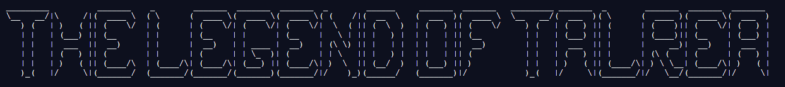

# Welcome!


Welcome to this fabulous text adventure! In _The Legend of Talera_, you are an adventurer that will collect different artifacts from places around Talera.

You will get a level of four things. They are **knowledge**, **strength**, **charisma**, and **speed**. It may look something like this:
```
Your knowledge level is 4.
Your strength level is 6.
Your charisma level is 2.
Your speed level is 10.
Your average level is 5.5.
```
I would suggest that you write these scores down, as you cannot come back to them.

You will also get numbered choices. The right choice will depend mostly on your levels. It may look something like this:
```
Here are your options:
1) Fight
2) Run
3) Negotiate
```
These are the basics of this game. Happy playing!
## Obtainable Items
Here are the current items you can get:
 - Talera Ruby
 - Shattered Ruby Pieces

More items are coming, so stay tuned!
## Updates
### Beta 0.1
 - Created Legend of Talera
### Beta 0.2
 - Fixed various bugs
### Beta 0.3
 - Added more hosts to the waiting room
 - Added a message if you do not have any trophies

## Future Updates
In future updates, _The Legend of Talera_ will include:
 - New forest level
 - New mountain level
 - Save and load feature
 - Skip text feature
 - A surprise feature

## How to add to this code with Github
First, pull the latest code.
Then, create a new branch. Please name it in this format:

**initials/name-of-program**

For instance, a branch could look like:

**rb/example-branch**

After you finish your edits, commit and push. Add a message saying what you did, and then make a pull request.

## Credits
**Game Development**
 - [@HipsterDave](https://repl.it/@HipsterDave "HipsterDave")
 - [@Vadercat](https://repl.it/@Vadercat "Vadercat")

**Beta-Testers**
 - [@Vadercat](https://repl.it/@Vadercat "Vadercat")
 - [@CodecusMaximus](https://repl.it/@CodecusMaximus "CodecusMaximus")
___
Also, check out this project on [Github](https://github.com/HipsterDave/The-Legend-of-Talera).
